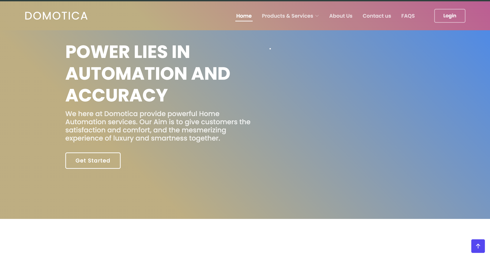
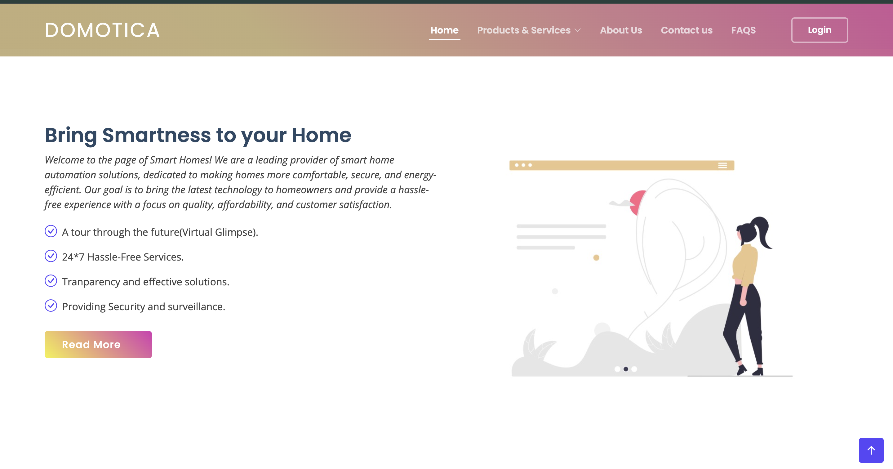
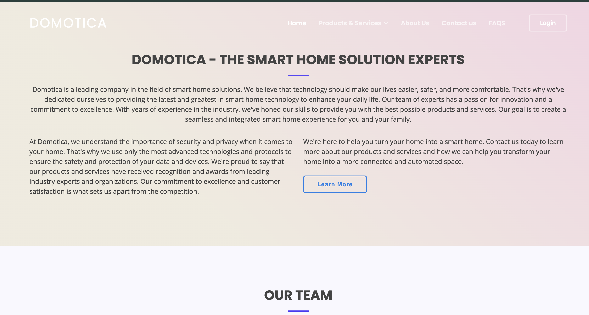
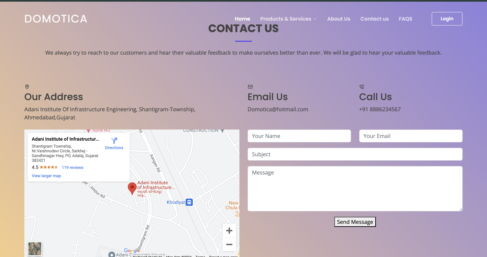
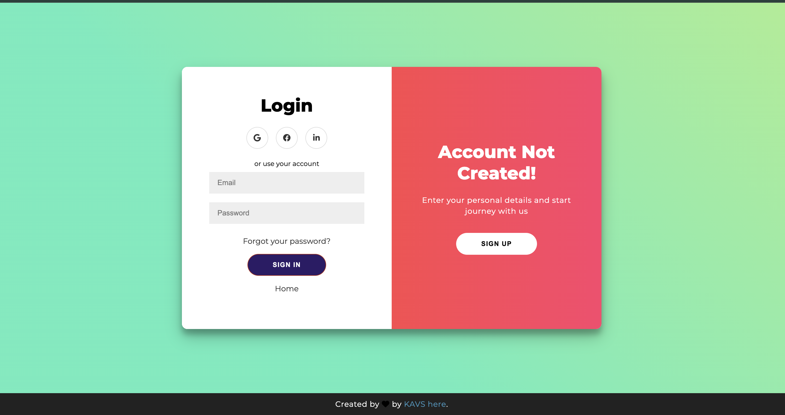

# Domotica: Your Dream Smart Home Awaits 🏡 ✨

**Smart Home, Elevated.** Domotica isn't just a website; it's your future smart home, brought to life with captivating 3D virtual tours. Crafted with HTML, CSS, JavaScript, and the robust Django framework, Domotica empowers you to effortlessly control every facet of your home.

## Key Features 🔑

- **Immersive 3D Virtual Tours:** Step into your dream home before it's even built! Explore every nook and cranny, personalize finishes, and experience the layout in stunning 3D. 🚶‍♂️💫
- **Elegant UI Design:** Domotica's interface is a masterpiece of form and function. Clean lines, seamless navigation, and personalized themes make managing your home a delightful experience. ✨🎨

## Upcoming Enhancements 🚧

- **Energy Optimization:** Intelligently manage your energy consumption and reduce your bills with insightful data and automated adjustments. ⚡📊
- **Enhanced Security:** Fortify your home's security with integrated cameras, motion sensors, and smart locks, all accessible through Domotica. 🛡️👀

## Tech Stack 🛠️

- **Frontend:** HTML, CSS, JavaScript
- **Backend:** Django

## UI

<div style="display: flex; gap: 20px;align-items:center;">

  
  

</div>











## Get Started 🚀

**Clone the Repository:**

```bash
git clone https://github.com/Vr978/Domotica.git
```

**Install Django**

```bash
pip install python
pip install django
```

**Launch the server**

```bash
python manage.py runserver
```

# Join the Community! 🤝
We thrive on community contributions! Feel free to report issues, submit pull requests, or share your innovative ideas to enhance Domotica's capabilities.

# Let's shape the future of smart homes together! 🌟